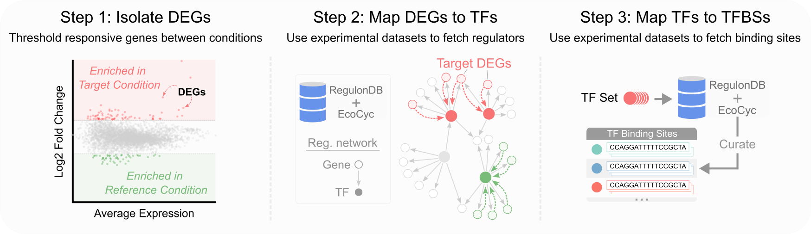

## **deg2tfbs**

A pipeline to derive transcription factor binding sites from comparative RNA-seq and proteomic data, focusing on *E. coli* but extendable to other organisms. This tool identifies differentially expressed genes (DEGs) between experimental conditions, maps them to upstream transcription factors using [**RegulonDB**](https://regulondb.ccg.unam.mx/) or [**EcoCyc**](https://ecocyc.org/) databases, and then retrieves their corresponding transcription factor binding sites (TFBSs) if available.  



## **Pipeline Steps**

1. **degfetcher** *(Step 1: Isolate DEGs)*  
   - Loads comparative omics datasets from the ```dnadesign-dna``` repository.
   - Produces tidy CSV outputs, e.g. `mori_upregulated_degs.csv`, containing columns:  
     - **gene** - DEG identifier
     - **source** – the source dataset (e.g., "mori"), aliased by the author's name in the literature
     - **comparison** – the experimental context, defining the target vs. reference condition (e.g., "acetate_vs_LB_media")

2. **tffetcher** *(Step 2: Map DEGs to TFs)*  
   - Reads the CSV outputs, saved in batches, from **degfetcher**.
   - Loads *regulatory interaction* datasets (e.g., from **RegulonDB** or **EcoCyc**).  
   - Fetches which transcription factors (TFs) reportedly regulate these DEGs (the “regulatees”).  
   - Produces a tidy CSV output, `deg2tf_mapping`, containing columns: 
     - **gene** - DEG identifier
     - **regulator** - transcription factor reported to regulated target gene
     - **polarity** - reported "type" of regulation imposed, if available
     - **source** – record of which regulatory interaction datasets were used
     - **is_global_regulator** – boolean indicating whether the regulator is classified as a global regulator by EcoCyc.
     - **is_sigma_factor** – boolean indicating whether the regulator is classified as a sigma factor by EcoCyc.
     - **deg_source** – indicating the source datasets in which this gene appears, as processed by degfetcher.

3. **tfbsfetcher** *(Step 3: Map TFs to TFBSs)*  
   - Reads the CSV outputs, saved in batches, from **tffetcher**.
   - Loads TFBS data from a resource (e.g. RegulonDB `.txt` or `.csv`).  
   - For each TF identified in step 2, fetch the corresponding binding site(s).  
   - Saves a final CSV that can be used downstream (e.g., in **dnadesign**).  

#### Directory Layout
```text
deg2tfbs/
├── README.md
├── __init__.py
├── main.py                         # CLI entry point
├── configs/                        # User-defined variables,
│   └── example.yaml                # customize to process different DEGs and retrieve different TFBSs
│   
└── pipeline/   
   ├── utils.py                    # Dictionary of paths to datasets in the dnadesign-data repository                    
   │
   ├── degfetcher/                 # Step 1: Isolate DEGs
   │   ├── __init__.py 
   │   ├── <dataset>_module.py     # Each omics dataset has its own respective module
   │   ├── <dataset>_module.py
   │   ├── ...
   │   └── degbatch_<date>/        # Batch of DEGs retrieved from degfetcher in a given run
   │       └── csvs                # In tidy format (req. cols: 'gene', 'source', and 'comparison')
   │       └── plots
   │
   ├── tffetcher/                  # Step 2: Map DEGs to TFs
   │   ├── __init__.py    
   │   ├── tffetcher.py            # Coordinates regulator retrieval for a given DEG batch
   │   ├── parsers/                # Each regulatory interaction dataset has a dedicated parser module
   │   │   ├── __init__.py
   │   │   ├── ecocyc_parser.py
   │   │   ├── regdb_parser.py     
   │   │   └── ...                 # Extendable to reference your own DEG->TF mapping file 
   │   │
   │   └── tfbatch_<date>/         # Batch of DEG->TF pairings retrieved from tffetcher in a given run
   │       └── deg2tf_mapping.csv                  
   │
   └── tfbsfetcher/                # Step 3: Map TFs to TFBSs
```


## **Usage**

1. Clone the [**```dnadesign-data```**](https://github.com/e-south/dnadesign-data) repository to access a curated set of comparative omics datasets. Placing it as a sibling directory to **```deg2tfbs```** enables ```degfetcher``` to generate custom DEG lists from these sources. 

2. **Install** dependencies **(WIP)**:  
   ```bash
   pip install -r requirements.txt
   ```  

3. **Update** `configs/mycustom.yaml` with desired datasets, thresholds, and output paths.  
   ```yaml
   # deg2tfbs/configs/example.yaml

   pipeline:
   name: "default"

   stages:
      degfetcher:
         root_dir: "pipeline/degfetcher"
         batch_id: "degbatch_20250130" # where to save isolated DEGs
         modules: # which source datasets to reference
            - ceroni
            - mori

      tffetcher:
         root_dir: "pipeline/tffetcher"
         batch_id: "tfbatch_20250130"
         input:
         deg_batch_id: "degbatch_20250130" # points to a degfetcher batch
         deg_csv_subdir: "csvs"            
            deg_csv_includes: # optional: only fetch regulators for these DEGs
               - "bie_downregulated_degs.csv"
               - "sanchez_vasquez_upregulated_degs.csv"
         sources:
         regulatory_networks:
            ecocyc:
               path: "ecocyc_28_reg_network" # reference to utils.DATA_FILES
               enabled: true
               parser: "ecocyc_network_v28-5"
            myothersource: ...
         params:
         network_strategy: "union" # how to merge results from different parsers
         include_master_regulators: true
         include_sigma_factors: true

      tfbsfetcher:
         root_dir: "pipeline/tfbsfetcher"
         batch_id: "tfbsbatch_20250130"
         input:
            tf_batch_id: "tfbatch_20250130"   # points to a tffetcher batch
         sources:
            binding_sites:
               regulondb_pssm: true
               ecocyc_motifs: false
         params: # Extend this as needed
            motif_confidence: "high"
      ```

4. **Run** from the command line:  
   ```bash
   cd deg2tfbs
   python main.py
   ```
   - ```degfetcher``` will tidy up lists of DEGs and save them as CSV files.
   
      For example, here is the head of the ```ceroni_upregulated_degs.csv``` file:
      | Gene  | Source  | Thresholds | Comparison                  |
      |-------|--------|------------|------------------------------|
      | groS  | ceroni | 2.5        | pLys-M1_versus_pLys          |
      | gadY  | ceroni | 2.5        | pLys-M1_versus_pLys          |
      | azuC  | ceroni | 2.5        | pLys-M1_versus_pLys          |
      | yadL  | ceroni | 2.5        | pPD864-LacZ_versus_pPD864    |
      | rclC  | ceroni | 2.5        | pPD864-LacZ_versus_pPD864    |
      | rclR  | ceroni | 2.5        | pPD864-LacZ_versus_pPD864    |

      **Customize:** To use a custom list of genes, create a CSV with required columns (e.g., 'gene', 'source', 'comparison'), place it in a subdirectory within ```degfetcher```, and point to it in a custom config file. Alternatively, if you saved your custom gene list in the cloned **```dnadesign-data```** repository, update the ```utils.py``` dictionary in ```pipeline``` to ensure datasets are located via ```DATA_FILES[...]```.

   - ```tffetcher``` will reference these CSV files to generate a ```deg2tf_mapping.csv``` file.

      | Gene  | Regulator | Polarity | Source                     | Global Regulator | Sigma Factor | DEG Source      |
      |-------|-----------|----------|----------------------------|------------------|--------------|-----------------|
      | aaea  | crp       | +        | ecocyc_28_AND_regdb_13     | yes              | no           | houser_up       |
      | aaea  | aaer      | +        | ecocyc_28                  | no               | no           | houser_up       |
      | aaeb  | crp       | +        | ecocyc_28_AND_regdb_13     | yes              | no           | houser_up       |
      | abga  | nac       | -        | ecocyc_28_AND_regdb_13     | yes              | no           | ceroni_up       |
      | acca  | accd      | -        | ecocyc_28                  | no               | no           | houser_down     |
      | acca  | rpod      | +        | ecocyc_28                  | no               | yes          | houser_down     |
      | adia  | adiy      | +        | ecocyc_28_AND_regdb_13     | no               | no           | ouser_up-lu_up  |
      
      **Customize:** To use a custom gene-to-regulator mapping file, create a specific parser for it and update the config. TFFetcher should automatically incorporate it.

   - ```tfbsfetcher``` will reference a ```deg2tf_mapping.csv``` file to generate a ```tf2tfbs_mapping.csv``` file.


### Data Source
Requires source data from [**```dnadesign-data```**](https://github.com/e-south/dnadesign-data). Update the config file to point to the correct data paths.
