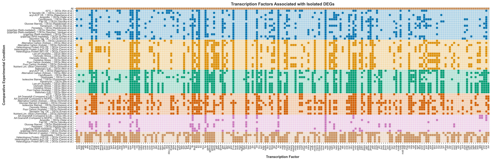

## **deg2tfbs**

**deg2tfbs** is a pipeline to derive transcription factor binding sites (TFBSs) from comparative RNA-seq and proteomic data, focusing on *E. coli* but extendable to other organisms. The process identifies differentially expressed genes (DEGs) between experimental conditions, maps them to upstream transcription factors (TFs) using [**RegulonDB**](https://regulondb.ccg.unam.mx/) or [**EcoCyc**](https://ecocyc.org/) databases, and then retrieves cognate transcription factor binding sites (TFBSs) if available.  


## **Installation**

**Prerequisites**

- [Conda](https://docs.conda.io/) or [Miniconda](https://docs.conda.io/en/latest/miniconda.html)
- (Optional) [Mamba](https://mamba.readthedocs.io/) for faster dependency resolution


**Step 1.** Clone the repository
```bash
git clone https://github.com/e-south/deg2tfbs.git
cd deg2tfbs
```

**Step 2.** Create the Conda environment
```bash
conda env create -f environment.yml
```
This command will read the ```environment.yml``` file and create a Conda environment named ```deg2tfbs``` with all the necessary packages installed.

**Step 3.** Activate the environment
```bash
conda activate deg2tfbs
```

**Step 4.** Install the Local `deg2tfbs` Package in Editable Mode
```bash
(deg2tfbs) cd deg2tfbs
(deg2tfbs) pip install -e .
```
This allows Python to recognize **deg2tfbs** as an installed package while still linking directly to the source files in the repository. Any changes made to the source code will be immediately available without requiring reinstallation.

## Directory Layout
```text
deg2tfbs/
├── README.md
├── pyproject.toml
├── environment.yml
├── LICENSE
└── src/
    └── deg2tfbs/
        ├── __init__.py
        ├── main.py                         # CLI entry point
        ├── configs/                        # User-defined configurations
        │   └── example.yaml                # Customize to process different DEGs and retrieve different TFBSs
        └── pipeline/
            ├── utils.py                    # Dictionary of paths to datasets (from dnadesign-data)
            ├── degfetcher/                 # Step 1: Isolate DEGs
            │   ├── __init__.py 
            │   ├── <dataset>_module.py     # Each omics dataset has its own respective module
            │   └── degbatch_<date>/        # Batch of DEGs retrieved from degfetcher in a given run
            │       ├── csvs                
            │       └── plots
            ├── tffetcher/                  # Step 2: Map DEGs to TFs
            │   ├── __init__.py    
            │   ├── tffetcher.py            # Coordinates TF retrieval for a given DEG batch
            │   ├── parsers/                
            │   │   ├── __init__.py
            │   │   ├── ecocyc_parser.py
            │   │   ├── regdb_parser.py     
            │   │   └── ...                 
            │   └── tfbatch_<date>/         
            │       └── deg2tf_mapping.csv  
            └── tfbsfetcher/                # Step 3: Map TFs to TFBSs
                ├── __init__.py    
                ├── tfbsfetcher.py          # Coordinates TFBS retrieval for a given set of TFs
                ├── parsers/                
                │   ├── __init__.py
                │   ├── ecocyc_tfbs_parser.py
                │   ├── regdb_tfbs_parser.py    
                │   └── ...                 
                └── tfbsbatch_<date>/  
```


## **Pipeline Steps**

1. **degfetcher** *(Step 1: Isolate DEGs)*  
   - Loads comparative omics datasets from the [**dnadesign-dna**](https://github.com/e-south/dnadesign-data) repository.
   - Produces tidy CSV outputs, such as `ceroni_upregulated_degs.csv`, containing columns:  
     - **gene**: DEG identifier.
     - **source**: The source dataset (e.g., "ceroni").
     - **thresholds**: Optional column specifying user-defined DEG thresholds from the config file.
     - **comparison**: The experimental context defining the target vs. reference condition.

      For example:
      | gene  | source  | thresholds | comparison                  |
      |-------|--------|------------|------------------------------|
      | groS  | ceroni | 2.5        | pLys-M1_versus_pLys          |
      | gadY  | ceroni | 2.5        | pLys-M1_versus_pLys          |
      | azuC  | ceroni | 2.5        | pLys-M1_versus_pLys          |
      | yadL  | ceroni | 2.5        | pPD864-LacZ_versus_pPD864    |
      | rclC  | ceroni | 2.5        | pPD864-LacZ_versus_pPD864    |
      | rclR  | ceroni | 2.5        | pPD864-LacZ_versus_pPD864    |


2. **tffetcher** *(Step 2: Map DEGs to TFs)*  
   - Reads CSV outputs, saved in batches, from **degfetcher**.
   - Loads **regulatory network**-type datasets curated from a resource (e.g., from **RegulonDB** or **EcoCyc**).  
   - Fetches TFs that reportedly regulate these DEGs (the “regulatees”).  
   - Produces a tidy CSV output, `deg2tf_mapping`, containing columns: 
     - **gene** - DEG identifier.
     - **regulator**: TFs reported to regulated target gene.
     - **polarity**: Reported "type" of regulation applied to gene, if available.
     - **source**: Record of which regulatory network dataset(s) were used.
     - **is_global_regulator**: Boolean indicating whether the regulator is classified as a global regulator by EcoCyc.
     - **is_sigma_factor**: Boolean indicating whether the regulator is classified as a sigma factor by EcoCyc.
     - **deg_source**: Indicates the source dataset(s) in which this gene appears, as processed by degfetcher.

      For example:
      | gene  | regulator | polarity | source                     | is_global_regulator | is_sigma_factor | DEG Source       |
      |-------|-----------|----------|----------------------------|---------------------|-----------------|------------------|
      | aaea  | crp       | +        | ecocyc_28_AND_regdb_13     | yes                 | no              | houser_up        |
      | aaea  | aaer      | +        | ecocyc_28                  | no                  | no              | houser_up        |
      | aaeb  | crp       | +        | ecocyc_28_AND_regdb_13     | yes                 | no              | houser_up        |
      | abga  | nac       | -        | ecocyc_28_AND_regdb_13     | yes                 | no              | ceroni_up        |
      | acca  | accd      | -        | ecocyc_28                  | no                  | no              | houser_down      |
      | acca  | rpod      | +        | ecocyc_28                  | no                  | yes             | houser_down      |
      | adia  | adiy      | +        | ecocyc_28_AND_regdb_13     | no                  | no              | houser_up-lu_up  |


3. **tfbsfetcher** *(Step 3: Map TFs to TFBSs)*  
   - Reads CSV outputs, saved in batches, from **tffetcher**.
   - Loads **TFBS**-type data curated from a resource (e.g. RegulonDB `.txt` or `.csv`).  
   - For each TF identified in step 2, fetch the corresponding binding site(s).  
   - Saves a final CSV output, `tf2tfbs_mapping`, containing:
  
      | Column              | Description |
      |---------------------|--------------------------------------------------------------------------------------------------|
      | **tf**              | The transcription factor name (lowercase)                                                        |
      | **tfbs**            | The TF binding site sequence (normalized to uppercase letters)                                   |
      | **gene**            | The DEG (or gene) associated with this TF mapping                                                |
      | **deg_source**      | A hyphen-delimited string indicating the source DEG datasets. For example, `houser_down-schmidt_down-durfee_down-bie_up` shows that multiple DEG datasets contributed to this mapping.                                                                                             |
      | **polarity**        | The regulatory polarity (e.g., "-" for repression, "+" for activation)                           |
      | **tfbs_source**     | A string indicating which TFBS resource(s) supplied the binding site (e.g., "regdb" or "ecocyc") |
      | **is_sigma_factor** | Boolean flag (e.g., "no") indicating whether the TF is a sigma factor                            |
      | **is_global_regulator** | Boolean flag (e.g., "no") indicating whether the TF is a global regulator                    |

   ***Caution:*** In ```tfbsfetcher.py```, there is a final TFBS deduplication check that is stringent and does not account for cases where binding sites differ by ±1 nucleotide at either end.

## Custom DEG CSV Grouping
In addition to a default “process all available DEGs” approach, you can specify custom combinations of DEG CSVs using the **deg_csv_groups** key within the **tffetcher** configuration. This functionality lets you define exactly which subset(s) of DEG CSVs to process downstream. There are three ways to define a group:

- **Global:**  
  An empty group (e.g. `all: {}`) processes all DEG CSV files in a degbatch subdirectory.

- **Filter-Based:**  
  Define a filter pattern (e.g. `all_up: { filter: "up" }`) to select only those CSVs whose filenames contain the specified substring.

- **Explicit Combination:**  
  Specify an explicit list of files. For example:
  
  ```yaml
  deg_csv_groups:
    heat_shock_up:
      files:
        - { file: "kim_upregulated_degs.csv", comparison: "42C_versus_control" }
        - { file: "zhang_upregulated_degs.csv", comparison: "sigma32-I54N_expression_versus_control" }
  ```

## **Running the Pipeline**

1. Clone the [**dnadesign-data**](https://github.com/e-south/dnadesign-data) repository to access a curated set of comparative omics datasets. Placing it as a sibling directory to **deg2tfbs** enables **degfetcher** to generate custom DEG tables from these sources. 

2. Update ```configs/mycustomparams.yaml``` with the desired I/O paths, batch IDs, and custom DEG CSV groups. For instance:
   ```yaml
   # deg2tfbs/configs/example.yaml
    pipeline:
        name: "default"

        stages:
            degfetcher:
                root_dir: "pipeline/degfetcher"
                batch_id: "degbatch_20250130"
                modules:
                    - ceroni
                    - mori

            tffetcher:
                root_dir: "pipeline/tffetcher"
                batch_id: "tfbatch_20250130"
                input:
                    deg_batch_id: "degbatch_20250130"
                    deg_csv_subdir: "csvs"
                    # Define custom groups:
                    deg_csv_groups:
                        all: {}  # Process all CSVs
                        all_up:
                            filter: "up"  # Process all CSVs with "up" in the name
                        heat_shock_up:
                            files:
                            - { file: "kim_upregulated_degs.csv", comparison: "42C_versus_control" }
                            - { file: "zhang_upregulated_degs.csv", comparison: "s32-I54N_vs_control" }
                sources:
                    regulatory_networks:
                        ecocyc:
                            path: "ecocyc_28_reg_network"
                            enabled: true
                            parser: "ecocyc_network_v28-5"
                params:
                    network_strategy: "union"
                    include_master_regulators: true
                    include_sigma_factors: true

            tfbsfetcher:
                root_dir: "pipeline/tfbsfetcher"
                batch_id: "tfbsbatch_20250130"
                input:
                    tf_batch_id: "tfbatch_20250130"  # This pointer is updated per group
                sources:
                    binding_sites:
                    ecocyc:
                        path: "ecocyc_28_tfbs_smart_table"
                        ecocyc_motifs: true
                    regdb:
                        path: "regulondb_13_tf_ri_set"
                        regulondb_pssm: false
                params:
                    pass
    ```

3. After configuring your `mycustomparams.yaml`, run the pipeline as follows:
   ```bash
   cd deg2tfbs
   python main.py # Make sure that the bottom of this module references your config file.
   ```
   - **degfetcher** processes the datasets and outputs DEG CSVs.
   - **tffetcher** then processes these CSVs in each custom group (using **deg_csv_groups**) to produce distinct `deg2tf_mapping.csv` files.
   - **tfbsfetcher** uses the appropriate TF mapping to produce a final `tf2tfbs_mapping.csv` for each group.


### **Extendability**

The **degfetcher**, **tffetcher**, and **tfbsfetcher** steps are designed to be extendable. You can add your own dataset ingestion modules for **degfetcher** or develop custom parser modules for **tffetcher** and **tfbsfetcher**.

To use your own custom input genes, create a CSV with required columns: 'gene', 'source', 'comparison'. Then place it in a "batch" subdirectory within **degfetcher**, and point to it in your custom config file. Alternatively, if you added a new gene table in a cloned **dnadesign-data** repository, update the ```utils.py``` dictionary in ```pipeline``` to ensure datasets can be found via ```DATA_FILES[...]```.

When creating a custom parser, make sure it conforms to one of the following interfaces:

- For **tffetcher** parsers:  
  Implement: Dict[gene, Set[Tuple[TF, polarity]]])
  ```python
  parse(...) -> Dict[str, Set[Tuple[str, str]]]
  ```
  This signature allows **tffetcher.py** to process new **regulatory network** data the same.

- For **tfbsfetcher** parsers:  
  Implement: Dict[TF, Set[TFBS_1, TFBS_2, TFBS_3, ...]]
  ```python
  parse(...) -> Dict[str, Set[str]]
  ```
  This signature allows **tfbsfetcher.py** to process new **TFBS** data the same.


## Analysis of Pipeline Results

The **analysis** folder contains scripts that visualize the results generated by the **pipeline**. These visualizations help answer the question:

> "Does fetching different sets of DEGs lead to different sets of transcription factors?"

#### Generating TF Rosters

The analysis scripts read the `tf2tfbs_mapping.csv` files produced by **tfbsfetcher**. For each of these files—which are derived from a specific set of DEGs—a binary TF roster is generated. Each roster is a vector whose length equals the total number of unique transcription factors identified by the pipeline. An option is provided to remove “intersections” (i.e., to exclude transcription factors that appear in two defined sets) before further analysis. You specify which directories to include by listing them under the `comparisons` key in your configuration file (e.g., `configs/example.yaml`):

```yaml
analysis:
  comparisons:
    - [ "tfbsbatch_20250209_ciprofloxacin_up", "tfbsbatch_20250209_ciprofloxacin_down" ]
    - [ "tfbsbatch_20250209_ampicillin_up", "tfbsbatch_20250209_ampicillin_down" ]
    - ...
  # When true, transcription factors that appear in both comparison groups 
  # (i.e., the intersection) are removed from the roster.
  exclude_intersections: true
```

Each roster is saved as a tab-delimited file with columns such as:

```text
regulator   group1   group2   intersection   group1_only   group2_only
acrr        1        0        0              1             0
ada         0        1        0              0             1
agar        1        0        0              1             0
aidb        0        1        0              0             1
allr        0        0        0              0             0
alls        0        0        0              0             0
arac        0        0        0              0             0
arca        1        1        1              0             0
argp        0        0        0              0             0
```

#### Visualization

The `main.py` script in **analysis** produces several plots that are saved in **analysis/plots**. One of two possible subdirectories are created based on the `exclude_intersections` flag in your configuration:

- **all_regs:** When intersecting transcription factors are **not** removed.
- **intersects_removed:** When intersecting transcription factors **are** removed.

A heatmap is generated to provide a global view of all the TF rosters (representing the presence or absence of transcription factors). Each roster is treated as a multidimensional vector and then clustered using the Leiden algorithm. For example:



*This clustering approach helps to determine whether different sets of DEGs, enriched under distinct environmental conditions, are associated with similar transcription factors. For instance, the TF rosters identified for DEGs downregulated in the presence of kanamycin and ciprofloxacin are similar. In contrast, these rosters are distinct from the transcription factors associated with DEGs upregulated under nutrient limitation.*

Beyond viewing all TF rosters together, the value counts of unique TF binding sites for each TF roster (derived from `tf2tfbs_mapping.csv` files) can also be visualized. For example:


---

### Data Source
**deg2tfbs** is designed to reference data from [**dnadesign-data**](https://github.com/e-south/dnadesign-data). Update the config file to point to the correct data paths.
