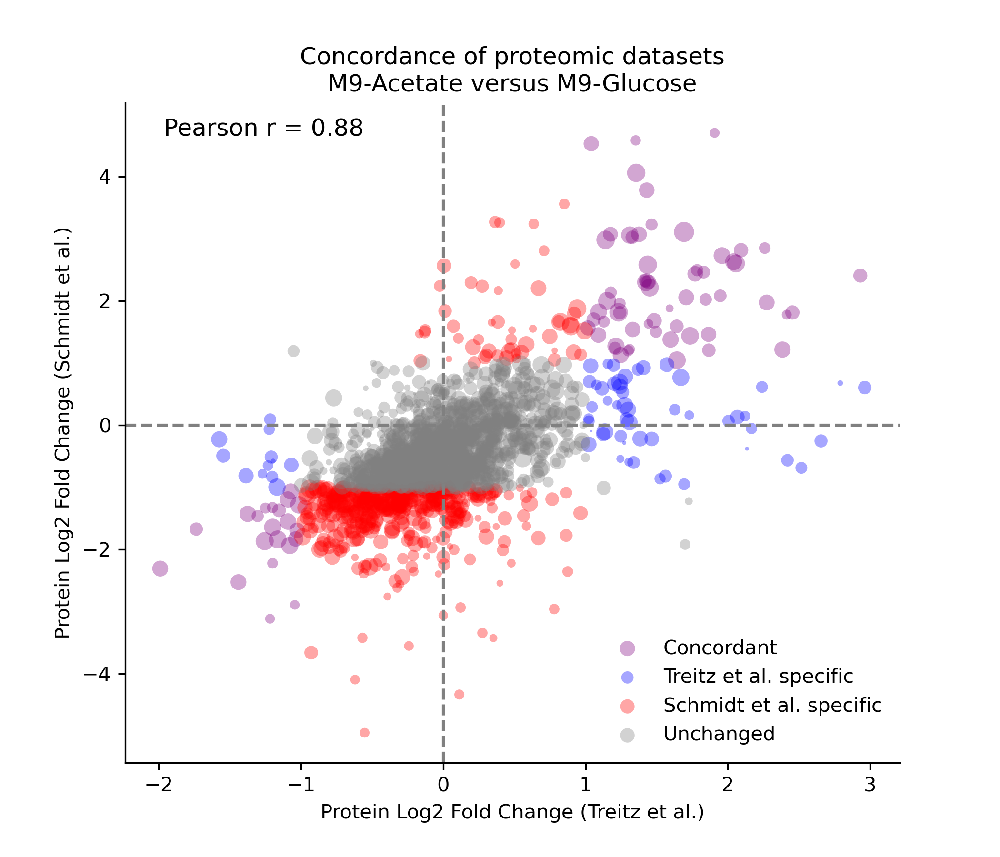

## **deg2tfbs**

**deg2tfbs** is a pipeline to derive transcription factor binding sites (TFBSs) from comparative RNA-seq and proteomic data, focusing on *E. coli* but extendable to other organisms. The process identifies differentially expressed genes (DEGs) between experimental conditions, maps them to upstream transcription factors (TFs) using [**RegulonDB**](https://regulondb.ccg.unam.mx/) or [**EcoCyc**](https://ecocyc.org/) databases, and then retrieves cognate transcription factor binding sites (TFBSs) if available.  


## **Installation**

**Prerequisites**

- [Conda](https://docs.conda.io/) or [Miniconda](https://docs.conda.io/en/latest/miniconda.html)
- (Optional) [Mamba](https://mamba.readthedocs.io/) for faster dependency resolution


**Step 1.** Clone the repository
```bash
git clone https://github.com/e-south/deg2tfbs.git
cd deg2tfbs
```

**Step 2.** Create the Conda environment
```bash
conda env create -f environment.yml
```
This command will read the ```environment.yml``` file and create a Conda environment named ```deg2tfbs``` with all the necessary packages installed.

**Step 3.** Activate the environment
```bash
conda activate deg2tfbs
```

**Step 4.** Install the Local `deg2tfbs` Package in Editable Mode
```bash
(deg2tfbs) cd deg2tfbs
(deg2tfbs) pip install -e .
```
This allows Python to recognize **deg2tfbs** as an installed package while still linking directly to the source files in the repository. Any changes made to the source code will be immediately available without requiring reinstallation.

## Directory Layout
```text
deg2tfbs/
├── README.md
├── pyproject.toml
├── environment.yml
├── LICENSE
└── src/
    └── deg2tfbs/
        ├── __init__.py
        ├── main.py                         # CLI entry point
        ├── configs/                        # User-defined configurations
        │   └── example.yaml                # Customize to process different DEGs and retrieve different TFs and TFBSs
        └── pipeline/
            ├── utils.py                    # Dictionary of paths to datasets (from dnadesign-data)
            ├── degfetcher/                 # Step 1: Isolate DEGs
            │   ├── __init__.py 
            │   ├── <dataset>_module.py     # Each omics dataset has its own respective module
            │   └── degbatch_<date>/        # Batch of DEGs retrieved from degfetcher in a given run
            │       ├── csvs                
            │       └── plots
            ├── tffetcher/                  # Step 2: Map DEGs to TFs
            │   ├── __init__.py    
            │   ├── tffetcher.py            # Coordinates TF retrieval for a given DEG batch
            │   ├── parsers/                
            │   │   ├── __init__.py
            │   │   ├── ecocyc_parser.py
            │   │   ├── regdb_parser.py     
            │   │   └── ...                 
            │   └── tfbatch_<date>/         
            │       └── deg2tf_mapping.csv  
            └── tfbsfetcher/                # Step 3: Map TFs to TFBSs
                ├── __init__.py    
                ├── tfbsfetcher.py          # Coordinates TFBS retrieval for a given set of TFs
                ├── parsers/                
                │   ├── __init__.py
                │   ├── ecocyc_tfbs_parser.py
                │   ├── regdb_tfbs_parser.py    
                │   └── ...                 
                └── tfbsbatch_<date>/  
```


## **Pipeline Steps and Example Use Case**

1. **degfetcher** *(Step 1: Isolate DEGs)*  
   - Loads comparative omics datasets from the [**dnadesign-dna**](https://github.com/e-south/dnadesign-data) repository.
   - Produces tidy CSV outputs, such as `schmidt_upregulated_degs.csv`, containing columns:  
     - **gene**: DEG identifier.
     - **source**: The source dataset (e.g., "schmidt").
     - **thresholds**: Optional column specifying user-defined DEG thresholds from the config file.
     - **comparison**: The experimental context defining the target vs. reference condition.

      For example:
      | gene  | source  | thresholds | comparison                |
      |-------|---------|------------|---------------------------|
      | acnB  | schmidt | 1.5        | Acetate_vs_Glucose        |
      | maeB  | schmidt | 1.5        | Acetate_vs_Glucose        |
      | aldA  | schmidt | 1.5        | Acetate_vs_Glucose        |
      | aceB  | schmidt | 1.5        | Chemostat_slow_vs_fast    |
      | gltA  | schmidt | 1.5        | Chemostat_slow_vs_fast    |
      | gatY  | schmidt | 1.5        | Chemostat_slow_vs_fast    |

    Beyond outputting thresholded DEGs as CSV files, many **degfetcher** data ingestion modules also generate plots to visualize the full dataset for added context.

    

    **A quick use case:**

    The example above highlights up- and down-regulated genes during *E. coli* growth in M9-acetate versus M9-glucose, using proteomic data from [**Schmidt *et al.***](https://www.nature.com/articles/nbt.3418). The `schmidt.py` module processes this dataset to identify DEGs and generate the corresponding MA plot.

    To further increase confidence in DEG selection, we wrote another module in **degfetcher** to threshold on data from [**Treitz *et al.***](https://analyticalsciencejournals.onlinelibrary.wiley.com/doi/10.1002/pmic.201600303), which also collected *E. coli* protein abundance data, grown in either M9-acetate to M9-glucose. 
    
    
    
    Among these two datasets, 1881 genes are shared, and their log₂ fold-change values can be visualized in a concordance plot:

    

    We then generated two CSVs detailing the purple points:
    - `treitz_schmidt_concordant_up.csv`
    - `treitz_schmidt_concordant_down.csv`
    
    The next step is to find which transcription factors are associated with these DEGs.

2. **tffetcher** *(Step 2: Map DEGs to TFs)*  
   - Reads CSV outputs, saved in batches, from **degfetcher**.
   - Loads **regulatory network**-type datasets (i.e., TF-gene connections) curated from a database (e.g., from **RegulonDB** or **EcoCyc**).  
   - Fetches TFs that reportedly regulate these DEGs (the “regulatees”).  
   - Produces a tidy CSV output, `deg2tf_mapping`, containing columns: 
     - **gene** - DEG identifier.
     - **regulator**: TFs reported to regulated target gene.
     - **polarity**: Reported "type" of regulation applied to gene, if available.
     - **source**: Record of which regulatory network dataset(s) were used.
     - **is_global_regulator**: Boolean indicating whether the regulator is classified as a global regulator by EcoCyc.
     - **is_sigma_factor**: Boolean indicating whether the regulator is classified as a sigma factor by EcoCyc.
     - **deg_source**: Indicates the source dataset(s) in which this gene appears, as processed by degfetcher.

      For example:
      | gene  | regulator | polarity | source                     | is_global_regulator | is_sigma_factor | is_nucleoid_regulator |
      |-------|-----------|----------|----------------------------|---------------------|-----------------|-----------------------|
      | acea  | arca      | -        | ecocyc_28                  | yes                 | no              | no                    |
      | acea  | ihfa      | +        | ecocyc_28                  | yes                 | no              | yes                   |
      | acea  | iclr      | -        | ecocyc_28_AND_regdb_13     | no                  | no              | no                    |
      | acea  | ihf       | +        | regdb_13                   | no                  | no              | yes                   |
      | aceb  | rpod      | +        | ecocyc_28                  | no                  | yes             | no                    |
      | aceb  | cra       | +        | ecocyc_28_AND_regdb_13     | yes                 | no              | no                    |
      | aceb  | lrp       | +        | ecocyc_28_AND_regdb_13     | yes                 | no              | no                    |

      In addition to the mapping file, tffetcher can perform statistical testing (e.g., a Fisher's Exact Test) to prioritize TFs that are enriched for regulating DEGs. For each TF, we construct a 2x2 continguency table to assess enrichment of DEGs among its targets:
      |                 | DEG (Observed) | Non-DEG (Not observed) | 
      |-----------------|----------------|------------------------|
      | TF Targets      | a              | K - a                  |
      | Non-TF Targets  | M - a          | N - K - (M - a)        |

      where:
      - a is the number of DEGs that are targets of the TF.
      - K is the total number of targets for the TF (as defined in the regulatory network).*
      - M is the number of DEGs present in the background.
      - N is the total number of genes in the background.
      
      ***Note:*** *In enrichment analysis, the term background (i.e., the entire population) refers to the set of all genes that could theoretically be detected as DEGs in the experiment. In our case, the curated regulatory networks (from EcoCyc and RegulonDB) include over 3,000 genes, yet an experimental dataset from **degfetcher** may contains only a subset (e.g., the 1,881 genes in the above Treitz-Schmidt concordant plot). Therefore, we would filter the regulatory network to include only genes present in the concordant plot. This ensures that only measurable genes contribute to the background, preventing an inflated denominator.*

      A one‑tailed Fisher's Exact Test (testing for overrepresentation) was applied to yield a raw p‑value for each TF. P‑values are then adjusted for multiple testing using the Benjamini–Hochberg (BH) method. TFs can then be ranked in ascending order by their FDR-corrected p‑values. This “Top-N” method prioritizes TFs showing the strongest enrichment of regulated DEGs, based on the assumption that such overrepresentation may indicate condition-specific regulatory activity (e.g., between M9-acetate and M9-glucose).

      ***Note:*** Enrichment scores (a/K) and p-values from the Fisher's Exact Test are related—but they’re not the same, and they don’t always move together.
      - The enrichment fraction (a/K) - This measures what proportion of a TF's targets are differentially expressed
      - The absolute number of gene targets - This affects statistical power and confidence

      

      The Fisher's Exact Test is sensitive to both the proportion and the total counts.
    
     
3. **tfbsfetcher** *(Step 3: Map TFs to TFBSs)*  
   - Reads CSV outputs, saved in batches, from **tffetcher**.
   - Loads **TFBS**-type data curated from a resource (e.g. RegulonDB `.txt` or `.csv`).  
   - For each TF identified in step 2, fetch the corresponding binding site(s).  
   - Saves a final CSV output, `tf2tfbs_mapping`, containing:
  
      | Column              | Description |
      |---------------------|--------------------------------------------------------------------------------------------------|
      | **tf**              | The transcription factor name (lowercase)                                                        |
      | **tfbs**            | The TF binding site sequence (normalized to uppercase letters)                                   |
      | **gene**            | The DEG (or gene) associated with this TF mapping                                                |
      | **deg_source**      | A hyphen-delimited string indicating the source DEG datasets. For example, `treitz_schmidt_concordant_up` shows that multiple DEG datasets contributed to this mapping.                                                                                             |
      | **polarity**        | The regulatory polarity (e.g., "-" for repression, "+" for activation)                           |
      | **tfbs_source**     | A string indicating which TFBS resource(s) supplied the binding site (e.g., "regdb" or "ecocyc") |
      | **is_sigma_factor** | Boolean flag (e.g., "no") indicating whether the TF is a sigma factor                            |
      | **is_global_regulator** | Boolean flag (e.g., "no") indicating whether the TF is a global regulator                    |

   ***Caution:*** In ```tfbsfetcher.py```, there is a final TFBS deduplication check that is stringent and does not account for cases where binding sites differ by ±1 nucleotide at either end.

    The extent of unique TF binding sites for each TF (from the `tf2tfbs_mapping.csv` file) can be visualized, as shown below, or used in downstream analyses beyond the scope of *deg2tfbs*.

    


## **Running the Pipeline**

1. Clone the [**dnadesign-data**](https://github.com/e-south/dnadesign-data) repository to access a curated set of comparative omics datasets. Placing it as a sibling directory to **deg2tfbs** enables **degfetcher** to generate custom DEG tables from these sources. 

2. Update ```configs/mycustomparams.yaml``` with the desired I/O paths, batch IDs, and custom DEG CSV groups.
   
3. After configuring your `mycustomparams.yaml`, run the pipeline as follows:
   ```bash
   cd deg2tfbs
   python main.py # Make sure that the bottom of this module references your config file.
   ```
   - **degfetcher** processes the datasets and outputs DEG CSVs.
   - **tffetcher** then processes these CSVs in each custom group (using **deg_csv_groups**) to produce distinct `deg2tf_mapping.csv` files.
   - **tfbsfetcher** uses the appropriate TF mapping to produce a final `tf2tfbs_mapping.csv` for each group.


### **Extendability**

The **degfetcher**, **tffetcher**, and **tfbsfetcher** steps are designed to be extendable. You can add your own dataset ingestion modules for **degfetcher** or develop custom parser modules for **tffetcher** and **tfbsfetcher**.

To use your own custom input genes, create a CSV with required columns: 'gene', 'source', 'comparison'. Then place it in a "batch" subdirectory within **degfetcher**, and point to it in your custom config file. Alternatively, if you added a new gene table in a cloned **dnadesign-data** repository, update the ```utils.py``` dictionary in ```pipeline``` to ensure datasets can be found via ```DATA_FILES[...]```.

When creating a custom parser, make sure it conforms to one of the following interfaces:

- For **tffetcher** parsers:  
  Implement: Dict[gene, Set[Tuple[TF, polarity]]])
  ```python
  parse(...) -> Dict[str, Set[Tuple[str, str]]]
  ```
  This signature allows **tffetcher.py** to process new **regulatory network** data the same.

- For **tfbsfetcher** parsers:  
  Implement: Dict[TF, Set[TFBS_1, TFBS_2, TFBS_3, ...]]
  ```python
  parse(...) -> Dict[str, Set[str]]
  ```
  This signature allows **tfbsfetcher.py** to process new **TFBS** data the same.

---

### Data Source
**deg2tfbs** is designed to reference data from [**dnadesign-data**](https://github.com/e-south/dnadesign-data). Update the config file to point to the correct data paths.
